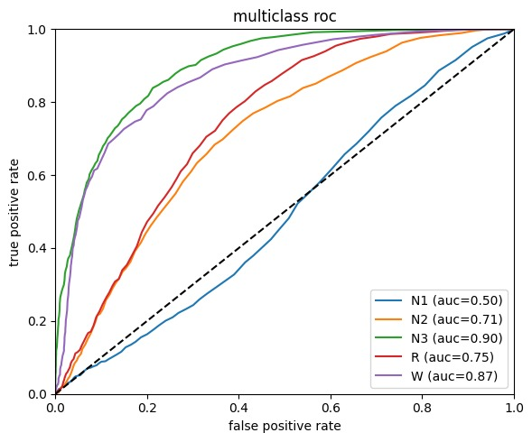
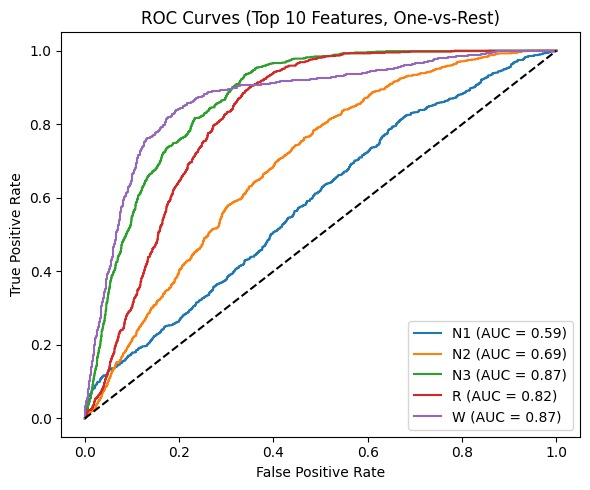

**Problem Statement**
Accurate sleep stage classification is essential for diagnosing sleep disorders, advancing circadian research, and supporting real‐time sleep‐monitoring solutions. Traditional methods rely on time‐consuming manual polysomnography (PSG), often overestimating sleep near the wake/N1 boundary due to similar frequency characteristics. We aim to optimize the classification of sleep stages from electroencephalography (EEG) data, with a special emphasis on accurately detecting sleep onset (i.e., differentiating wakefulness from early-stage sleep, particularly N1). Traditional methods often rely on in-bed intervals and multimodal recordings, resulting in overclassification of sleep and underestimation of wake time—major challenges for patients with low sleep efficiency. Our goal is to reduce false positives for sleep onset and achieve high sensitivity in detecting real transitions into sleep, thereby improving both clinical utility and potential real-time monitoring applications.

We specifically target reducing confusion between relaxed wake and N1 epochs, which often share similar frequency spectra. By focusing on a binary classification task (W vs. N1) initially—and ultimately extending to all sleep stages—we seek robust models that handle variations in circadian patterns and electrode signals.

Accurate sleep staging is foundational for diagnosing sleep disorders, developing wearable sleep-trackers, and advancing circadian research. Manual scoring is labor-intensive and not scalable. A more efficient, fully automated approach could facilitate large-scale studies, improve patient monitoring, and potentially yield new biomarkers for sleep onset and circadian regulation.

Our primary performance metric is the area under the ROC curve (AUC), supported by accuracy, precision, and recall to capture both sensitivity (true sleep detection) and specificity (correct wake classification). Ultimately, we also plan to measure multi-class staging accuracy across standard stages (W, N1, N2, N3, REM).

Our datasets are MESA and ANPHY. At the moment, we are working on the ANPHY dataset, as we do not have the labels for the MESA dataset. This dataset is smaller in terms of subjects, but has a lot more samples per subject. There are 29 subjects with 93 EEG electrodes each, sampled at 1000 Hz, resulting in large data volumes. Memory and computational resources are limited, particularly when processing continuous recordings or training large transformer-based models.

We rely on raw EDF files (EEG) and corresponding sleep labels available at 30-second intervals. Downsampling and filtering are critical to reduce data size while preserving key frequency information.

Possible issues include overfitting to specific subjects, losing crucial information during downsampling, mislabeled epochs near wake–sleep transitions, and high computational costs leading to incomplete or stalled experiments. These risks necessitate careful model validation and efficient data handling.

**Technical Approach**
Our current pipeline focuses on classical machine learning models—Logistic Regression, Support Vector Machine (SVM), and Random Forest—applied to filtered, downsampled EEG windows for binary (W vs. N1) classification. We started with 29 subfolders (EPCTL01, EPCTL02, …) where each folder contains an EDF file (EEG signals with 93 channels at 1000 Hz) and a CSV file (sleep stage labels for 30‑second epochs).

*Data Preprocessing*
Window Extraction: For each subject, we select epochs labeled W and N1. For each chosen label, we extract a 2‐second window (±1 second) of EEG data.
Filtering & Downsampling: We notch out 60 Hz line noise (Q=30), apply a 4th‐order lowpass filter at 90 Hz, and downsample from 1000 Hz to 200 Hz, resulting in 400 samples per 2‐second window.

*Feature Organization*
Each electrode’s window is saved to a structured data format (pickle or CSV), maintaining subject ID, electrode ID, and class label.
Electrode channels are grouped into subsets to manage memory usage when loading data for model training.

*Classification Models*
For binary classification, we use the following models:
Logistic Regression: A linear baseline to gauge how well simple decision boundaries distinguish W from N1.
SVM: Kernel‐based model (e.g., RBF) capturing non‐linear separations in EEG features.
Random Forest: Ensemble approach leveraging multiple decision trees, often robust against overfitting in this binary scenario.
We also started to explore the classification of all sleep stages, with XGBoost and Random Forest.

*Validation*
We perform cross‐subject validation: train on some subjects and test on different subjects (70% and 30% split).
Primary metrics include ROC AUC, accuracy, and confusion matrices to assess W vs. N1 discrimination.

**Initial Results**
*For binary classification:* Our pipeline successfully processes data for all 29 subjects and 93 electrodes. By selecting one epoch labeled W and one labeled N1 per subject, we create balanced training sets of short EEG windows. Preliminary results show:

ROC AUC ≈ 0.90
Early tests indicate strong separation between W and N1 under these conditions.
Consistent Accuracy Across Models
Logistic regression, SVM, and random forest all demonstrate competitive performance. Ensemble methods like random forest slightly outperform simpler models on some folds.

*For multiclass classification:* We started to explore the classification of all sleep stages, with XGBoost and Random Forest. These are the ROC curves for each stage:

XGBoost is performing better than Random Forest. N3 and W are above 0.9, which is good. However, N1 performance is unsatisfactory, which was expected.
Additionally, we analyzed the feature importance from the best XGBoost model. It seems that the most important features are the catch22 features, which is interesting.

**Next Steps**
*Scale to Full Multi‐Stage Classification*
Fully extend the pipeline beyond W and N1 to all standard sleep stages (W, N1, N2, N3, REM).

*Build a Deep-Learning Model*
Move on form from simple classical models to a more complex approach such as NNs.

*Increase Training Coverage*
Use more epochs per subject to capture greater intra‐subject variability.

*Swith to MESA Dataset*
Include external dataset (MESA) for more subjects, which will result in better training. To do this, we need to find the sleep stage labels for the dataset.

*Figure out ELectrode Positions for Anatomical Mapping*
When looking at the csv's of the ANPHY data, the electrodes have certain labels such as "Fp1Ref". We want to figure out which scalp position each label corresponds to so that we could create an anatomical mapping. This would aid in a better understanding o sleep staging.

By continuing to optimize data handling and classification models, we aim to build a scalable system for accurate, automated sleep staging.